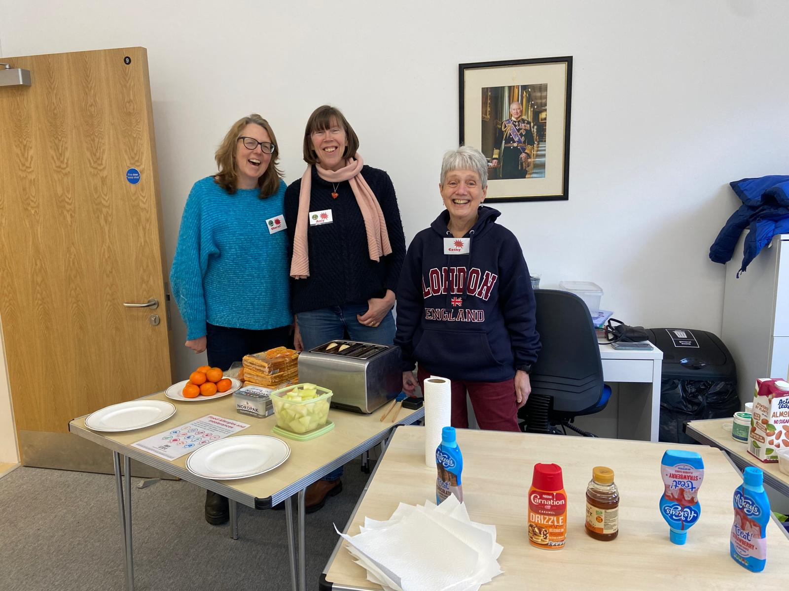
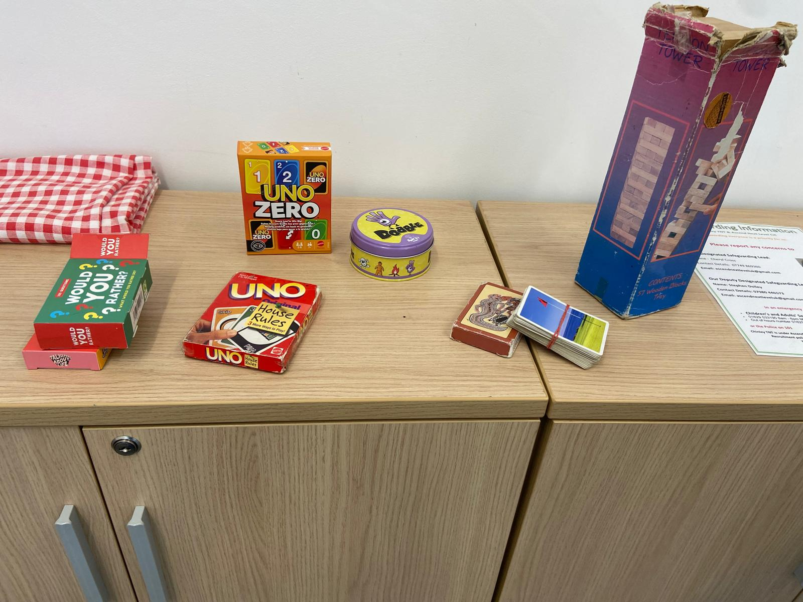
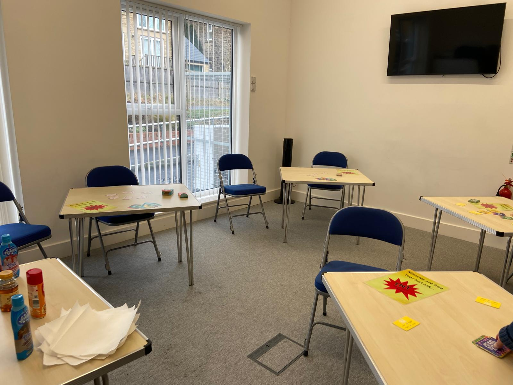

# Secondary School After School Drop-In

## Term-Time Opening 3.30-4.30pm Fridays

## What is TnT?

-   Tea and Toast (actually Hot Chocolate, waffles and toppings)
-   After-school drop-in at the end of the school week
-   A safe place to chill and chat
-   For secondary school children
-   Friday afternoons 3.30pm – 4:30pm
-   In Chinley Community Centre
-   Free hot or cold drink (water, squash, tea, coffee or hot chocolate) and toasted waffles

## Who is Running TnT?

-   Run by Ascend Next Level with volunteers from Chinley
-   Safeguarding oversight by Ascend Next Level

## House Rules

-   Only secondary school children will be allowed in
-   If you stay to chat and are under 14, you must show that you have your parent's permission and give your parent's contact phone number.
-   You are free to come and go as you please.
-   Show respect to the leaders and each other, and to other users of the Community Centre.
-   Use of mobile-phones is fine, as long as it is not offensive, disrespectful or disturbing others
-   No smoking, alcohol or drugs on the premises.
-   If a TnT helper asks you to modify your behaviour and you do not, you will be asked to leave.

## Safeguarding

Ascend Next Level have prepared the Risk Assessment, Safeguarding arrangements and Volunteer Role descriptions. All TnT leaders and helpers are DBS checked and receive regular Safeguarding training.

[The Safeguarding Policy can be seen here](https://docs.google.com/document/d/1JWWDKvsyEFi-WyY9fUl8ISyQ_DP5Sb7Qf4PoVJKeHDU/edit?usp=drive_link).

You can enquire about TnT via:

-   Contact Form
-   TnT@ascendnextlevel.org.uk

